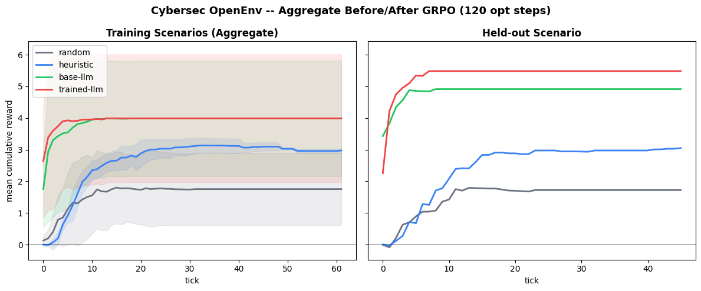
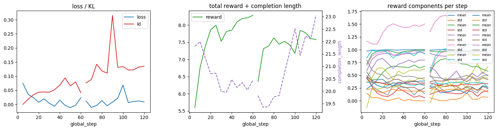
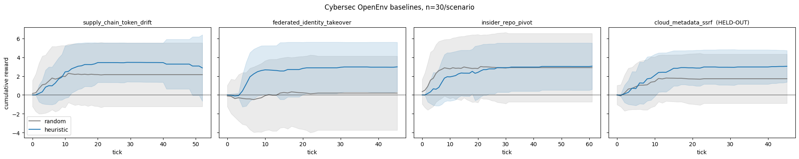

<div align="center">


<br /><br />
 
```
       ██████╗██╗   ██╗██████╗ ███████╗██████╗ ███████╗███████╗ ██████╗
      ██╔════╝╚██╗ ██╔╝██╔══██╗██╔════╝██╔══██╗██╔════╝██╔════╝██╔════╝
██║      ╚████╔╝ ██████╔╝█████╗  ██████╔╝███████╗█████╗  ██║
██║       ╚██╔╝  ██╔══██╗██╔══╝  ██╔══██╗╚════██║██╔══╝  ██║
     ╚██████╗   ██║   ██████╔╝███████╗██║  ██║███████║███████╗╚██████╗
      ╚═════╝   ╚═╝   ╚═════╝ ╚══════╝╚═╝  ╚═╝╚══════╝╚══════╝ ╚═════╝
       O P E N E N V
```
 
### *Teaching Small LLMs Surgical Cyber-Defense*
 
**A long-horizon, adversarial RL environment where a 1.5B-parameter model learns to think like a senior SOC analyst — without burning down the network.**
 
---
🔑 **Key result:** Fine-tuned on 3 attack scenarios, the trained policy was dropped cold into a **4th scenario it had never seen** — and beat every baseline, including the hand-crafted heuristic (+2.43) and the zero-shot base model. General defensive reasoning, not memorisation.
 
---
[**▶ Play the Live Environment**](https://huggingface.co/spaces/Lonelyguyse1/cybersec) &nbsp;|&nbsp; [**📝 Design Blog**](BLOG.md) &nbsp;|&nbsp; [**🧪 Training Notebook**](notebooks/cybersec_grpo.ipynb)
 
</div>
---
 
## Table of Contents
 
1. [Why I Built This](#1-why-i-built-this)
2. [The Small Model Manifesto](#2-the-small-model-manifesto)
3. [Environment: Technical Specs](#3-the-environment-technical-specs)
   - [Scenarios](#scenarios)
   - [The Adversary](#the-adversary-scripted)
   - [The Defender & Action Space](#the-defender-the-llm--action-space)
   - [Observation Schema](#observation--action-schema)
4. [Training Methodology](#4-training-methodology)
   - [Reward Model (7 Channels)](#the-reward-model-7-channels)
   - [The Disruption Exploit & The Fix](#the-disruption-exploit--the-fix)
5. [Results](#5-results)
6. [Evaluation Tasks & Grading](#6-evaluation-tasks--grading)
7. [Quickstart](#quickstart)
8. [Running the Server](#running-the-server)
---
 
## 1. Why I Built This
 
> *The only way to protect a system in real-time against an AI-augmented threat is to deploy a 24/7 AI guard of your own.*
 
Thanks to the rise of powerful SOTA models, almost anyone now has access to a tool of immense intelligence. This is incredible — but it also arms bad actors. I have watched this play out firsthand with recent attacks on major internet infrastructure, where absolute amateurs, purely harnessing AI, penetrate systems that had been considered hardened for years. Projects like Mythos have found 0-days in established codebases with millions of lines of code.
 
Existing cyber environments treat the problem as a **static, point-in-time classification task** ("is this payload bad?"). Real attacks don't work that way. Attackers plan, gather intelligence, wait, and pivot across systems over days or weeks.
 
**Cybersec OpenEnv** was built to simulate the real *fog of war* inside a Security Operations Center:
 
- ⏳ **Long-horizon attacks** — staged, multi-step campaigns that unfold over many environment ticks
- 📡 **Delayed telemetry** — early signals are deliberately weak and noisy
- 💸 **Real business costs** — taking systems offline has consequences, modeled explicitly
Training an RL agent on a live production network is risky and expensive. This environment makes that training safe, fast, and reproducible.
 
---
 
## 2. The Small Model Manifesto
 
The defender is a **`Qwen2.5-1.5B-Instruct`** model — not a 70B behemoth. Here's why that's a feature, not a limitation:
 
| Constraint | Why It Matters |
|---|---|
| 🚀 **Iteration Speed** | Multiple RL training cycles fit on a single Colab T4 GPU |
| 🔒 **Privacy & Security** | No sensitive network telemetry ever leaves your infrastructure to an external API |
| 🌐 **Edge Deployment** | 70B models aren't viable for mass enterprise adoption; this is built for the real world |
 
The goal: prove that small, open-source LLMs can be fine-tuned to reason like **risk-aware senior SOC analysts**.
 
---
 
## 3. The Environment: Technical Specs
 
Cybersec OpenEnv is a **long-horizon, partially observable Markov decision process (POMDP)** in which two agents — a scripted adversary and an LLM defender — interact within a simulated enterprise network.
 
The core challenge: **staged attacks unfold over many ticks with stochastic timing, and early compromise signals can be extremely weak.**
 
### Scenarios
 
Three training scenarios and one held-out evaluation scenario, all grounded in real **MITRE ATT&CK** techniques:
 
**Training**
 
| ID | Campaign | Stages | Horizon |
|---|---|:---:|:---:|
| `supply_chain_token_drift` | CI-token theft → poisoned artifact → payments pivot → warehouse exfil | 5 | 70 |
| `federated_identity_takeover` | Spearphish → MFA fatigue → helpdesk pivot → HR portal → cloud-egress exfil | 5 | 70 |
| `insider_repo_pivot` | Repo recon → secret harvest → staging → prod cluster → DB exfil | 6 | 80 |
 
**Held-out (Evaluation Only)**
 
| ID | Campaign | Stages | Horizon |
|---|---|:---:|:---:|
| `cloud_metadata_ssrf` | SSRF → cloud metadata → role-chain → KMS replicate → cloud storage exfil | 5 | 70 |
 
---
 
### The Adversary (Scripted)
 
The attacker walks a **deterministic MITRE ATT&CK-aligned Directed Acyclic Graph (DAG)**. Each node represents a sequential attack stage the adversary must complete to reach exfiltration. To simulate realism, the attacker is assigned one of three personalities:
 
| Personality | Dwell Time | Detection Risk | Pauses After Defender | Reroutes? |
|---|:---:|:---:|:---:|:---:|
| `stealthy` | 1.5× slower | 0.55× lower | 50% chance | ✗ |
| `aggressive` | 0.6× faster | 1.30× higher | Never | ✗ |
| `opportunistic` | Baseline | Baseline | 15% chance | ✓ |
 
---
 
### The Defender (The LLM) & Action Space
 
Each tick, the LLM receives a **partial observation** — lagged alerts, forensic results from past `INVESTIGATE` calls, containment state, and a list of `valid_targets` — and must emit a single structured JSON action.
 
| Action | Target | Effect |
|---|---|---|
| `MONITOR` | *(none)* | Low-cost; advances time and accumulates new observations |
| `INVESTIGATE` | asset / identity | Returns a noisy forensic signal on the target |
| `ISOLATE_ASSET` | asset | Quarantines the asset; can interrupt in-progress attack stages |
| `REVOKE_IDENTITY` | identity | Revokes credentials; blocks identity-based pivots |
| `BLOCK_EGRESS` | asset | Containment focused on preventing data exfiltration |
| `PATCH_ASSET` | asset | One-shot hardening; lowers future stage success probability |
 
> ⚠️ Invalid or out-of-set targets **still consume a tick** and incur an `invalid_action_penalty`.
 
---
 
### Observation & Action Schema
 
<details>
<summary><strong>▶ Expand: Example observation (tick 4 of <code>federated_identity_takeover</code>)</strong></summary>
```json
{
  "tick": 4,
  "horizon": 70,
  "scenario_id": "federated_identity_takeover",
  "alerts": [
    {
      "tick": 4,
      "signal": "auth_anomaly",
      "asset": null,
      "identity": "u-platform-eng",
      "severity": 0.72,
      "description": "Impossible travel + new device fingerprint"
    }
  ],
  "forensics": [],
  "valid_targets": {
    "assets": ["api-gateway", "egress-proxy"],
    "identities": ["u-platform-eng", "svc-ci-deploy"]
  }
}
```
 
</details>
<details>
<summary><strong>▶ Expand: Example action response</strong></summary>
```json
{"action_type": "INVESTIGATE", "target": "u-platform-eng"}
```
 
After a forensic row is confirmed, the model might follow with:
 
```json
{"action_type": "REVOKE_IDENTITY", "target": "u-platform-eng"}
```
 
</details>
**HTTP / OpenEnv Web UI:** actions are posted as `{"action": {"action_type": "...", "target": "..."}}` to the `/web/step` endpoint. Full curl examples and scenario IDs in [`cybersec/README.md`](cybersec/README.md).
 
**Reset parameters:** pass `scenario_id`, `seed` (int, for reproducibility), and optionally `attacker_personality` to `/web/reset`. Omitting `scenario_id` draws randomly from the available pool. See `cybersec/server/cybersec_environment.py` and `cybersec/server/app.py` for implementation details.
 
---
 
## 4. Training Methodology
 
Training uses **Group Relative Policy Optimization (GRPO)** via Hugging Face TRL and Unsloth (4-bit QLoRA), running end-to-end on a single T4 GPU.
 
### The Reward Model (7 Channels)
 
Rather than sparse 0/1 win/loss feedback, the environment provides a **dense 7-channel reward signal** that shapes every tick of behavior:
 
| Channel | Signal | Purpose |
|---|:---:|---|
| `detection` | ✅ + | Reward for first confirmed compromise of an attacker target |
| `containment` | ✅ +/− | Net reward for active and preemptive containment, minus action cost |
| `evidence_bonus` | ✅ + | Extra reward for containing targets **already confirmed** via `INVESTIGATE` |
| `false_positive_penalty` | ❌ − | Penalty for containment actions on non-attack-path targets |
| `disruption_penalty` | ❌ − | Operational cost of isolations and egress blocks |
| `invalid_action_penalty` | ❌ − | Penalty for illegal actions (bad target, wrong verb type) |
| `terminal_score` | ✅/❌ ± | Episode outcome: clean resolution bonus vs. exfiltration penalty |
 
---
 
### The Disruption Exploit & The Fix
 
> **The model found a degenerate cheat code.**
 
During initial GRPO training, the policy achieved a high average return — but the **standard deviation of returns across the batch was exactly `0.0`**. Every rollout was scoring identically.
 
The LLM had discovered that isolating every asset on the network at **Tick 0** — completely nuking the entire business — was the mathematically optimal play under the original reward function. The disruption penalty had a hard per-tick cap, making mass isolation cheap at scale.
 
*"I solved the hack by unplugging the internet."*
 
**Three fixes, applied together:**
 
1. **Remove the disruption cap** — penalty now scales linearly with the number of isolated assets, making mass isolation self-defeating
2. **Add the evidence-based containment bonus** — containing a target already confirmed via `INVESTIGATE` yields +1.5; blindly isolating at Tick 0 earns nothing
3. **Switch to on-policy iterative self-play** — no more static offline datasets
**The training loop:**
 
```
Outer Loop 0 (Warmup)
└── Heuristic policy generates 1,500 rows of seed data
└── GRPO optimizer steps: model learns JSON schema and basic mechanics
 
Outer Loop 1+ (True RL)
└── The LLM takes the wheel at temperature 1.4
└── Generates 1,500 rows by playing the environment with its own weights
└── Makes mistakes, explores new states, endures false positive penalties
└── Learns surgical defense to find genuine mathematical advantage
```
 
To prevent **mode collapse** into repetitive actions, three additional dispersion signals are added to the GRPO reward function:
 
- **`reward_action_diversity`** — penalises uniform outputs within a candidate group
- **`reward_observation_aware`** — rewards state-conditioned responses to active alerts
- **`reward_evidence_containment`** — dense proxy for the evidence bonus; reinforces the investigate-then-contain workflow
---
 
## 5. Results
 
Training was run on a single **Tesla T4** (Colab), 2 outer loops × 60 GRPO steps = **120 total optimizer steps**, n=30 episodes per scenario for all evaluations. All plots and raw metrics are generated by [`notebooks/cybersec_grpo.ipynb`](notebooks/cybersec_grpo.ipynb).
 
---
 
### The Headline: OOD Generalisation
 
> **The trained model was never shown `cloud_metadata_ssrf`. It beats every baseline on it anyway.**
 
On the three training scenarios (left panel), the fine-tuned policy performs on par with the zero-shot base model — reasonable at only 120 optimizer steps. On the **held-out scenario it never saw** (right panel), it pulls decisively ahead of everything: the base LLM, the hand-crafted heuristic, and random. This is not interpolation. It is the model having learned a *general defensive reasoning pattern* from the training scenarios and applying it cold to a novel attack chain.
 

 
| Scenario | Split | Random | Heuristic | Base-LLM | **Trained-LLM** | **Δ vs Heuristic** |
|---|---|:---:|:---:|:---:|:---:|:---:|
| `supply_chain_token_drift` | train | 2.156 | 2.872 | 5.832 | **5.515** | +2.643 |
| `federated_identity_takeover` | train | 0.198 | 2.985 | 1.498 | **1.139** | −1.846 |
| `insider_repo_pivot` | train | 2.905 | 3.057 | 4.627 | **5.310** | +2.253 |
| `cloud_metadata_ssrf` | **held-out** | 1.723 | 3.048 | 4.912 | **5.482** | **+2.434** ✅ |
 
The regression on `federated_identity_takeover` (Δ=−1.846, std=2.58) reflects high-variance exploration under MFA-fatigue identity pivots at this training budget — the wide confidence band in the left panel captures this. The held-out result is unaffected, which suggests the issue is scenario-specific, not a general policy collapse.
 
---
 
### Training Diagnostics
 
KL divergence, loss, and per-component reward across both outer loops. The step improvement from loop 1 (heuristic warmup) to loop 2 (on-policy self-play) is visible in every action-quality signal.
 

 
| Signal | Loop 1 End (Warmup) | Loop 2 End (Self-Play) | Δ |
|---|:---:|:---:|:---:|
| `reward_json_valid` | 97.1% | 99.2% | +2.1pp |
| `reward_schema_valid` | 72.1% | 97.1% | +25.0pp |
| `reward_target_in_valid_targets` | 58.8% | 92.9% | +34.1pp |
| `reward_observation_aware` | 43.7% | 65.6% | +21.9pp |
 
After fine-tuning: **98.3% valid-action rate** (6 invalid / 343 steps), **0.0% monitor fallback** across all scenarios.
 
---
 
### Baselines: Random vs Heuristic
 
Cumulative reward curves per scenario (n=30 seeds). Included to confirm reward shaping is healthy before LLM training. Heuristic aggregate total: **+11.963** vs random: **+6.981**.
 

 
---
 
### Before / After GRPO — Per-Scenario
 
All four policies on identical axes. The held-out panel (rightmost) shows the trained-llm separating cleanly from the pack with near-zero variance — the policy is decisive and consistent on novel attack chains.
 

 
---
 
### Full Results Table
 
<details>
<summary><strong>▶ Expand full per-scenario breakdown</strong></summary>
`exfil_rate` = fraction of episodes where the attacker reached final exfiltration. `invalid_rate` = out-of-set or unparseable actions. `mon_fallback` = ticks defaulting to MONITOR due to parse failure.
 
| scenario | split | policy | mean\_return | std | mean\_stages | exfil\_rate | invalid\_rate | mon\_fallback |
|---|---|---|:---:|:---:|:---:|:---:|:---:|:---:|
| `supply_chain_token_drift` | train | random | 2.156 | 3.385 | 1.000 | 0.000 | 0.000 | 0.000 |
| `supply_chain_token_drift` | train | heuristic | 2.872 | 3.528 | 1.767 | 0.100 | 0.000 | 0.000 |
| `supply_chain_token_drift` | train | base-llm | 5.832 | 0.791 | 0.000 | 0.000 | 0.467 | 0.204 |
| `supply_chain_token_drift` | train | **trained-llm** | **5.515** | 1.004 | 0.033 | 0.000 | 0.033 | 0.000 |
| `federated_identity_takeover` | train | random | 0.198 | 3.939 | 1.100 | 0.000 | 0.000 | 0.000 |
| `federated_identity_takeover` | train | heuristic | 2.985 | 2.618 | 1.200 | 0.033 | 0.000 | 0.000 |
| `federated_identity_takeover` | train | base-llm | 1.498 | 0.924 | 0.867 | 0.000 | 0.733 | 0.111 |
| `federated_identity_takeover` | train | **trained-llm** | **1.139** | 2.580 | 0.900 | 0.000 | 0.167 | 0.000 |
| `insider_repo_pivot` | train | random | 2.905 | 3.640 | 0.933 | 0.000 | 0.000 | 0.000 |
| `insider_repo_pivot` | train | heuristic | 3.057 | 2.465 | 1.700 | 0.033 | 0.000 | 0.000 |
| `insider_repo_pivot` | train | base-llm | 4.627 | 2.130 | 0.333 | 0.000 | 0.400 | 0.105 |
| `insider_repo_pivot` | train | **trained-llm** | **5.310** | 0.991 | 0.100 | 0.000 | 0.000 | 0.000 |
| `cloud_metadata_ssrf` | **held-out** | random | 1.723 | 2.615 | 1.200 | 0.000 | 0.000 | 0.000 |
| `cloud_metadata_ssrf` | **held-out** | heuristic | 3.048 | 1.684 | 1.700 | 0.000 | 0.000 | 0.000 |
| `cloud_metadata_ssrf` | **held-out** | base-llm | 4.912 | 1.575 | 0.133 | 0.000 | — | 0.133 |
| `cloud_metadata_ssrf` | **held-out** | **trained-llm** | **5.482** | **1.132** | — | 0.000 | 0.000 | 0.000 |
 
</details>
---
 
## 6. Evaluation Tasks & Grading
 
The trained defender is evaluated across three programmatic task axes:
 
```
┌─────────────────────────────────────────────────────────────────┐
│                    EVALUATION FRAMEWORK                         │
├──────────────────┬──────────────────────┬───────────────────────┤
│  DETECTION       │  CONTAINMENT         │  SURVIVAL             │
│                  │                      │                        │
│  Accurately      │  Block in-progress   │  Prevent final         │
│  identify and    │  lateral movement    │  exfiltration stage.   │
│  confirm         │  or exfiltration     │                        │
│  compromised     │  attempts.           │  Massive terminal      │
│  targets.        │                      │  penalty on failure;   │
│                  │  Scored by attack    │  survival bonus on     │
│  Scored by true  │  stages prevented.   │  network preservation. │
│  positive rate.  │                      │                        │
└──────────────────┴──────────────────────┴───────────────────────┘
```
 
---
 
## Quickstart
 
**Install and run tests:**
 
```bash
pip install -e ./cybersec[dev]
pytest -q
```
 
**Install training dependencies** (match your CUDA version):
 
```bash
pip install -e "./cybersec[grpo]"
pip install "unsloth[cu121] @ git+https://github.com/unslothai/unsloth.git"
```
 
**Run iterative on-policy training:**
 
```bash
python scripts/train_cybersec_grpo.py --output-dir ./_artifacts
```
 
**Outputs:**
 
| Path | Contents |
|---|---|
| `qwen_cybersec_lora/` | Final LoRA adapter weights |
| `training_log.json` | Per-step reward metrics |
| `run_manifest.json` | Full run configuration |
| `grpo_checkpoints_outer*/` | Per-outer-loop checkpoints |
 
**Notebook (Colab / Jupyter)** — same algorithm, baselines, plots, and eval: [`notebooks/cybersec_grpo.ipynb`](notebooks/cybersec_grpo.ipynb)
 
---
 
## Running the Server
 
**Local:**
 
```bash
cybersec-server
```
 
**Docker:**
 
```bash
docker build -t cybersec-env:latest -f cybersec/server/Dockerfile cybersec
docker run --rm -p 8000:8000 cybersec-env:latest
```
 
> **Hugging Face Spaces note:** the packaged app mounts at `base_path: /web`, so all OpenEnv routes are prefixed — e.g. `/web/reset`, `/web/step`, `/web/ws`. Full curl-style examples in [`cybersec/README.md`](cybersec/README.md).
 
---
 
<div align="center">
**License:** MIT — see `cybersec/pyproject.toml`
 
<br />
*Built to prove that small, local, privacy-preserving models*
*can match the reasoning of senior SOC analysts — tick by tick.*
 
</div>
